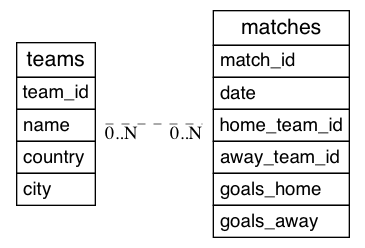

# Spring-exercise-2-Football-results-with-ORM
Exercise aiming at getting familiar with ORM concepts in Spring and using Hibernate and Spring Data JPA to create web applications.

## General information

Exercise consisted of following tasks:

1. Implement two entities: Team and Match.
2. Fill the database with sample data.
3. Retrieve following data and print it to console or browser:
    * All Teams and Matches
    * Best team
    * Teams which name contains "FC"
    * Match with most goals
    * Teams that played in more than one match
    * Teams and their total goal count
    * Matches played last week

## Used Technologies
* Java 11
* Maven
* Hibernate
* Spring Data JPA
* Spring Boot
* PostgresQL

## Project status
Still in progress.